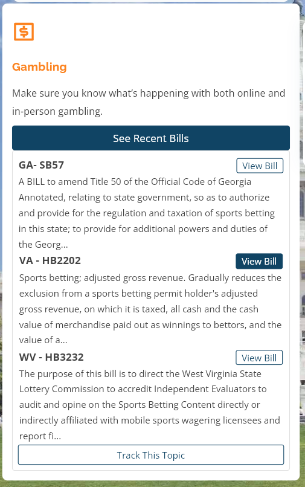
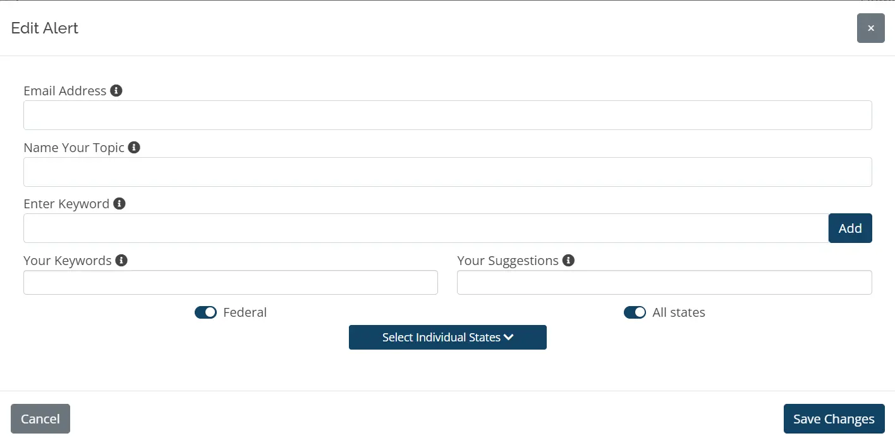
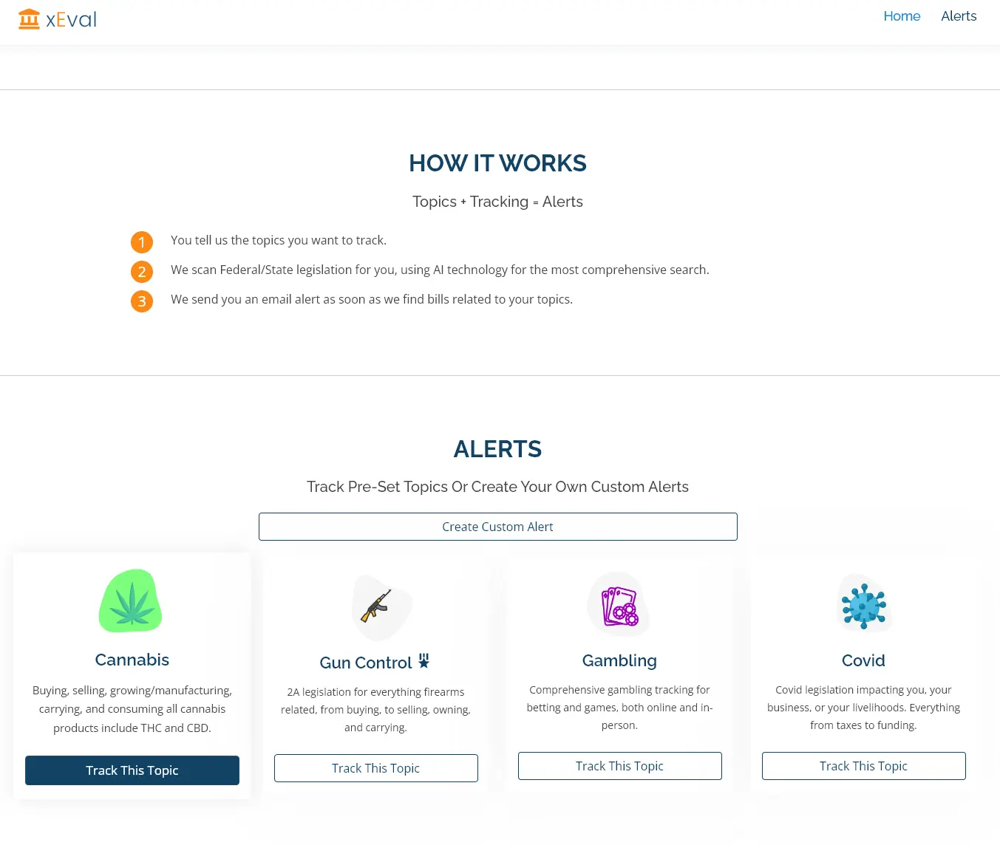
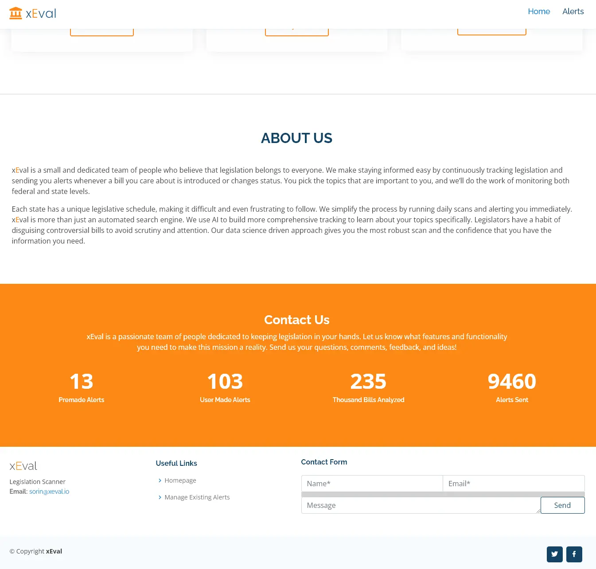

# xEval - <small> Legislation Alerts For The Topics You Care About </small>

xEval is a legislation alert platform that provides users with instant alerts, weekly recaps, and AI technology for comprehensive bill scanning. It covers pre-set topics like cannabis, gun control, gambling, Covid, and allows custom alerts. With three pricing plans ranging from free to business, xEval aims to make legislation accessible to all and offers personalized support. The website is user-friendly, offering a clean layout, pre-set and custom alerts, pricing options, and information about the team and mission. During Dec 2020 to Jan 2022, the xEval team established UI/frontend design and data science microservices, analyzed over 455k bills, and deployed the platform in AWS EC2/Lambda, using Git and Clubhouse/Slack for efficient management. The tools allow xEval to keep users informed about the legislation they care about.

### View Bills

The main goal was to provide users with up to date information about legislation before other news sources. One way we did this was to provide a recent bill widget that would allow <strong> other websites and our users </strong> to track the information they wanted. 

## Create Alert

Another way we did this was to provide a way for users to create custom alerts for legislation they cared about. This was done by creating a form that would allow users to input their information and then send it to our backend.

Here is an overview of the rest of the website and the features it offers.

## Overview

### Splash Screen

### Features

### About

